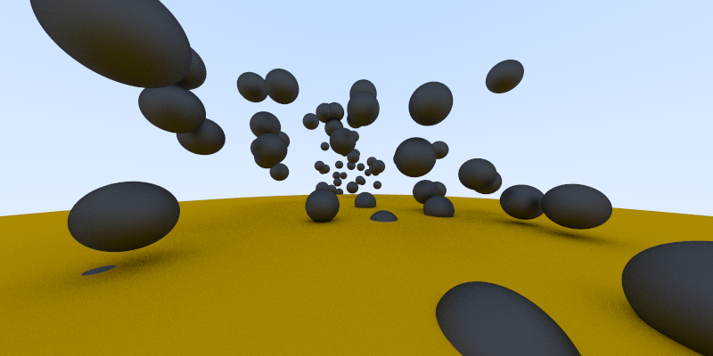
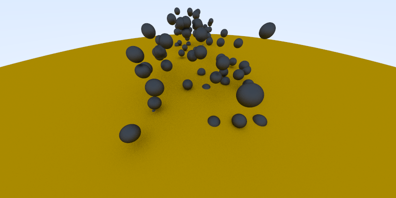
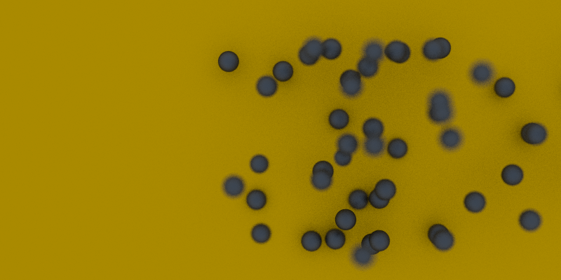

# RayTraceIn1Week

This is a practice project of Ray Tracing based on the book "[Ray Tracing in One Weekend](https://github.com/RayTracing/InOneWeekend)"

## My TODO

* Learning how to build using CMake
* Building the RayTracer with Qt
* Making cool images!!

## Images
#### Tapioca

#### Tapioca(high angle)

#### Tapioca(Defocus Blur)
